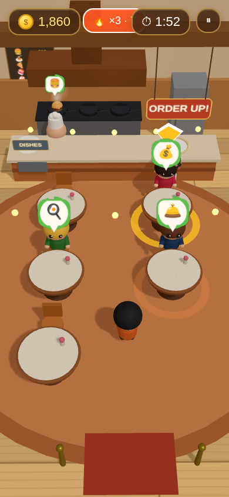
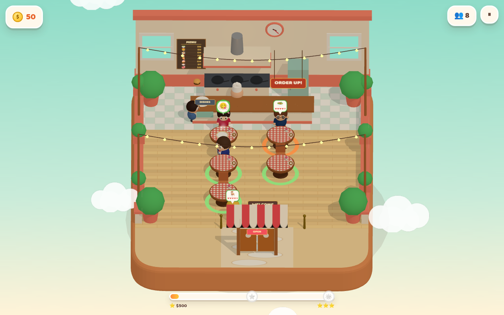

<div align="center">

# 🍽️ Table Rush

**Seat them. Serve them. Keep every heart full.**

A classic time-management restaurant game (think *Diner Dash*) in warm,
low-poly 3D. Built with **Three.js**, mobile-first, installable, offline-ready.

[](https://MordechaiN.github.io/TableRush/)


 

</div>

---

## The game

You run the floor. Guests line up at the door; **every tap is an explicit
command** to your waiter — nothing happens on its own:

```
1. SEAT     tap a waiting guest 🪑 → clean tables glow green → tap one
2. ORDER    their hand goes up → tap the table, the chit flies to the kitchen
3. COOK     the chef cooks it in plain sight — flames, steam, progress
4. PICK UP  the plate lands on the pass with a table-number flag → tap it
            (two hands = two plates; double deliveries pay a bonus)
5. DELIVER  tap the matching numbered table
6. COLLECT  they finish eating → 💵 → tap to collect the tip
7. BUS      tap the dirty table — dishes go to the washer, table's free again
```

### Hearts, tips & chains

- Every guest has **5 hearts** that drain while they wait — in line, hand up,
  waiting on the kitchen, waiting for the bill. Zero hearts = they storm out.
- **The tip is the hearts**: dish price × 5 × hearts remaining (floor 30%).
- **Chains**: consecutive *identical* actions (seat-seat-seat, collect-collect)
  stack a rising bonus. Plan your route like a pro.
- **VIPs** 👑 tip ×2.5 but fume fast. The **Food Critic** 🖋 (dark suit,
  notepad) pays ×3 — if you keep them at ≥85% hearts to the bill.
- Guest archetypes really differ: the Elder shuffles in but waits forever;
  the Teen sprints and won't.

### Levels

No timer — like the classics, a level is a guest list and a score goal.
Every unlocked level stays replayable from the title screen's level row,
so you can chase all the stars:

| Level | Name | Guests | New |
|---|---|---|---|
| 1 | First Shift | 8 | tutorial · Salad, Burger |
| 2 | Pasta Night | 12 | Pasta |
| 3 | Pizza Party | 16 | Pizza · VIPs 👑 |
| 4 | Sushi Rush | 20 | Sushi |
| 5 | Sweet & Sour | 24 | Cake · the Critic 🖋 |
| 6 | Noodle Fever | 27 | Ramen |
| 7 | Prime Time | 30 | Steak · the Critic returns |
| 8 | Full House | 34 | the whole menu, all at once |

Clear the ⭐ goal to unlock the next level; stars persist. The goal bar lives
at the bottom of the HUD, Diner-Dash style.

### The wallet

Every level's score banks into a persistent wallet, spent in the 🛒 Upgrades
shop (5 tiers each, all real):

| Track | Effect per tier |
|-------|-----------------|
| 👟 Swift Shoes | +8% waiter speed |
| 🔥 Pro Stove | −8% cooking time |
| 🪴 Cozy Décor | +8% guest patience |
| 😊 Warm Welcome | +6% tips |

## Controls

Tap = command. Tap a guest to select, a table to seat/order/deliver/collect/
clean, a plate to pick it up. Tap empty space to cancel a selection. Every
tap answers with a ripple — gold when it lands, gray when it misses.
⏸ / ESC pauses. That's everything. During the tutorial a pointing hand
hovers over the next suggested tap.

## Tech stack

| Part | Tech |
|------|------|
| Rendering | **Three.js** — real-time 3D, soft shadows, sRGB |
| Language | TypeScript (strict) |
| Build | Vite 5 |
| UI / HUD / menus | DOM + CSS, one design system, safe-area aware |
| Type | Baloo 2 (variable, self-hosted, OFL) |
| Audio | Web Audio API synthesis — music, room-tone ambience, SFX; zero audio files |
| Art | 100% procedural: cached low-poly geometry + canvas textures |
| Persistence | localStorage |
| Install | PWA — manifest, icons, offline via service worker |
| QA | Playwright harnesses — bot, real-input (mouse + touch), balance |
| Deploy | GitHub Pages via GitHub Actions |

## Architecture

```
index.html → src/main.ts                     orchestrator: title → level → level end
   ├─ src/three/title.ts                     3D mascot title + level select + chips
   ├─ src/three/RestaurantGame.ts            the level scene & simulation
   │    ├─ src/three/kitchen.ts              burners+flames, chef AI, pass slots
   │    ├─ src/three/effects.ts              pooled coins / sparks / steam / dust
   │    └─ src/three/builders.ts             art library (chibis, dishes, textures)
   ├─ src/three/ui.ts                        HUD, goal bar, ripples, overlays
   ├─ src/config/GameConfig.ts               levels, hearts, points, menu — every number
   └─ src/systems/
        ├─ ProgressionSystem.ts              level unlocks, stars, wallet, upgrades
        ├─ SoundManager.ts                   SFX, music loop, ambience, sizzle bed
        └─ Prefs.ts                          sound / music / haptics / reduced-motion
```

Design decisions worth knowing:

- **Explicit command queue** — taps become tasks (`seat/order/pickup/deliver/
  collect/clean`); the waiter executes them in order and *never* self-assigns
  work. `hotspots()` exposes everything currently tappable with screen
  coordinates — the same list drives input picking, the QA bots, and the
  tutorial's pointing hand.
- **Screen-space input picking** — the nearest actionable hotspot to the tap
  wins within a forgiving radius. No raycasting; works at any camera angle,
  fat-finger-proof.
- **Aspect-adaptive camera** — binary-search framing keeps queue, tables and
  kitchen on screen at any aspect ratio (portrait phones get the steep view).
- **The restaurant is alive** — swinging entrance doors, a chef who stirs and
  carries plates, a dish washer who scrubs what you bus, burner flames, a
  ticking wall clock, footstep dust, steam everywhere. Nothing teleports.
- **Fixed-substep simulation** — game time tracks real time even at 20fps.
- **Zero mid-game allocation** — cached geometry/materials, pooled particles.
- **Accessibility** — reduced-motion setting (no camera sway / screen
  flashes), haptics toggle, color+icon-coded action rings, generous
  tap targets.

## Local development

```bash
npm install
npm run dev             # http://localhost:3000
npm run type-check      # strict TS, no emit
npm run build           # type-check + production bundle → dist/
npm run playtest        # Playwright bot: clears level 1, checks shop/pause
npm run playtest:human  # plays with REAL mouse + touch events only —
                        # fails if any press has no effect
node qa/balance.mjs     # bot-plays every level, reports score vs goal
node qa/screenshot.mjs  # fresh title/gameplay screenshots
node scripts/gen-icons.mjs   # regenerate the PWA icons
```

QA hooks on `window.__game`: `hotspots()` (all tappable things + coords),
`autoStep()` (one smart tap through the real input pipeline), `levelState()`,
`metrics()`.

## Balancing

Everything lives in `src/config/GameConfig.ts`: the `LEVELS` table (guests,
spawn pace, hearts duration, goals, menu, VIP/critic flags), heart-decay
multipliers per waiting phase, action points, chain bonus, tip floor. Goals
are calibrated against bot playthroughs (`qa/balance.mjs`) so the ⭐ goal is
reachable at a relaxed pace and ⭐⭐⭐ demands chains, double-hand deliveries
and zero walkouts.

## Extending the game

- **New level**: add a row to `LEVELS`. Everything else follows — including
  the title screen's level select.
- **New dish**: add to `MENU_ITEMS`, model it in `builders.buildDish()`
  (the emoji comes from the menu entry), then put its id in a level's `dishes`.
- **New guest archetype**: add to `CUSTOMER_VARIANTS` (outfit, accessory,
  speed, patience). New accessories go in `builders.chibi()`.
- **New upgrade track**: add to `UPGRADE_TRACKS`, extend `getBoosts()`, apply
  the multiplier in the simulation. The shop UI renders it automatically.

## Roadmap

- [ ] Restaurant themes (diner → bistro → fine dining) as level backdrops
- [ ] More special events: birthday parties, health inspector
- [ ] Skeletal characters to replace the primitive chibis
- [ ] Localized UI

## Credits

Concept & Product — Mordechai Neeman · Implementation — Claude (Anthropic)
Type: [Baloo 2](https://github.com/EkType/Baloo2) by Ek Type, OFL.

MIT © 2026
