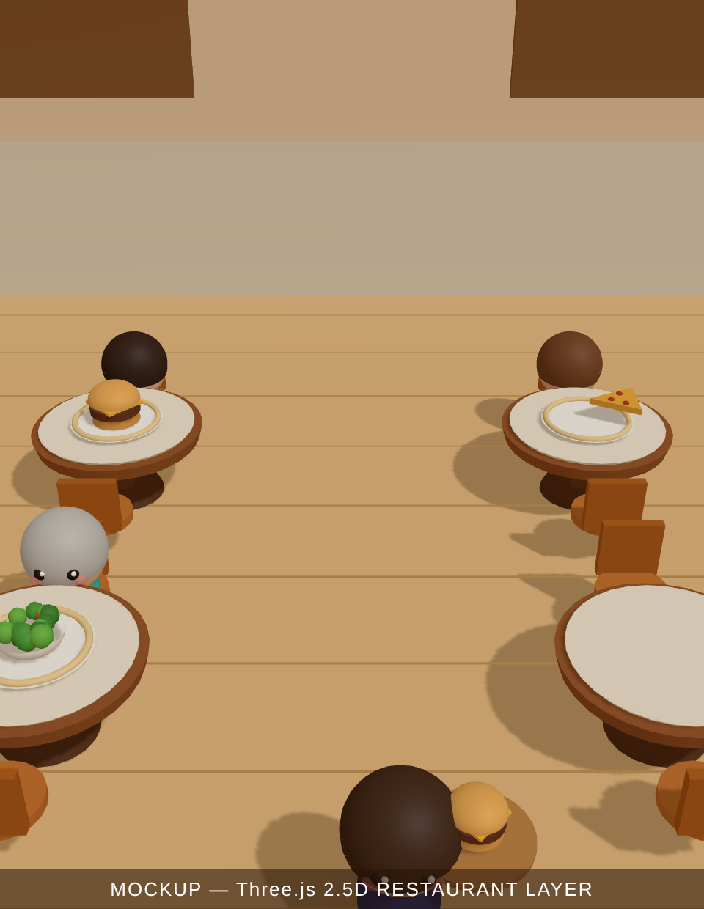
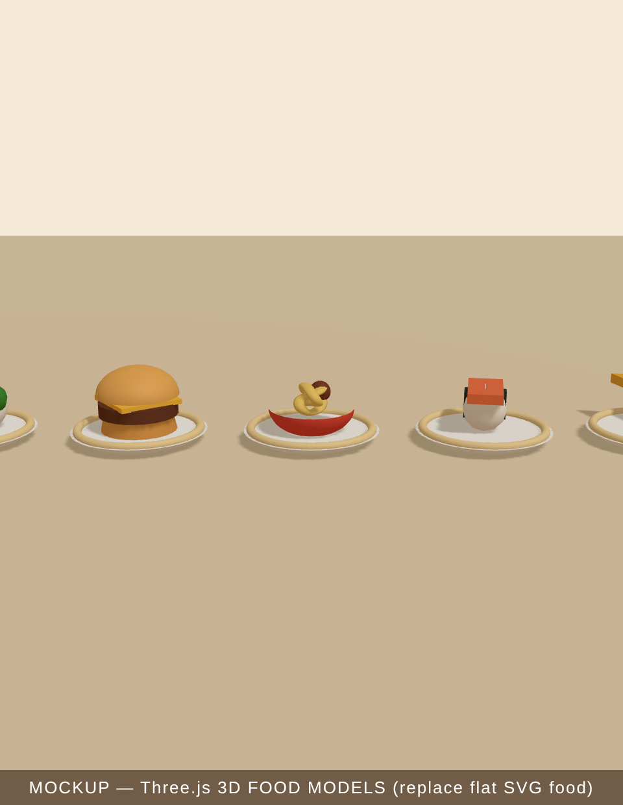
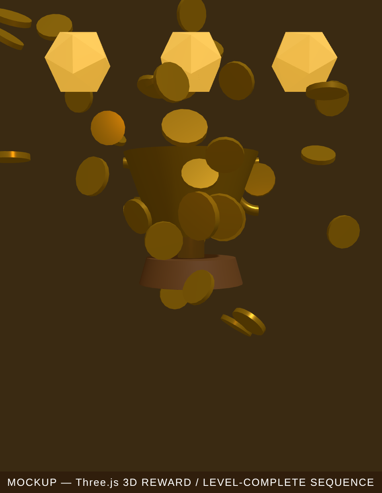

# Three.js in Table Rush — Technical Proposal

**Question:** How can Three.js make the *game* (not the launcher) feel more premium
and addictive — and what does it cost?

All mockups below are **real Three.js renders** (rev184), not concept art, captured
from `docs/proposals/threejs/`. Draw-call / triangle counts are measured from
`renderer.info`.

---

## TL;DR recommendation

Do **not** rewrite the gameplay into 3D, and do **not** run a second always-on 3D
canvas behind the live Phaser board. Both fight Phaser's depth model and the mobile
frame budget for little gain.

Instead, adopt Three.js in three **surgical, high-ROI** ways, in this order:

1. **Pre-rendered 3D assets → 2D sprites** (food, then characters). Premium look,
   **zero runtime 3D cost**, near-zero integration risk. _Highest ROI._
2. **On-demand 3D reward/level-complete sequences** (overlay canvas, spun up only
   for the moment, then disposed). Big dopamine, contained risk.
3. **(Optional, later) A static 3D restaurant backdrop** rendered to a texture at
   boot — depth/warmth of a real room with no per-frame 3D cost.

This keeps the proven Phaser gameplay loop intact while making everything the player
*looks at and gets rewarded by* look like a 2026 commercial game.

---

## The core architectural constraint (read this first)

Table Rush renders with Phaser's **painter's algorithm** across ~40 fine-grained
depth bands (`setDepth(0)` floor → `0.05` glow → `2.x` kitchen → `12` customers →
`15` arrows → `40‑56` HUD). The waiter walks *between* table-back and table-front
layers; customers sit *inside* the table footprint.

A WebGL canvas is a single flat layer in the DOM. So with **two stacked canvases**
(Three behind, Phaser in front) you **cannot interleave** them: every Phaser sprite
is always in front of every Three pixel. You lose "customer tucked behind the 3D
table edge," "waiter occluded by a 3D counter," etc. — exactly the depth cues that
sell a 3D room.

**Consequence:** a 3D layer behind live gameplay can only ever be a *non-interacting
backdrop* (walls, windows, far tables, ambient). The moment you want gameplay objects
to share 3D depth, you must render *everything* in one engine — i.e. a full renderer
rewrite. That's the fork every option below is judged against.

---

## Four hybrid architectures

| # | Approach | Depth-correct? | Runtime 3D cost | Integration risk | Verdict |
|---|----------|----------------|-----------------|------------------|---------|
| **A** | Pre-render 3D → sprite atlas, use in Phaser | n/a (2D) | **none** | **very low** | ✅ **Do first** |
| **B** | On-demand 3D overlay for reward moments | n/a (overlay) | only during FX | low | ✅ **Do** |
| **C** | Static 3D backdrop baked to one texture | backdrop only | **none** (baked) | low–med | ◑ Later |
| **D** | Live 3D backdrop canvas behind Phaser | backdrop only | +1 context, +1 pass | medium | ⚠️ Risky on low-end |
| **E** | Full migration: Three renders everything, Phaser = logic | **yes** | high | **very high** | ❌ Not now |

Approach **A** is the surprise winner: you get genuine 3D-quality art (lighting,
form, shadow) with *no* WebGL running during gameplay, because the 3D is baked to
flat textures Phaser already knows how to draw.

---

## Per-area evaluation

### 1. Restaurant visuals — _Approach C/D (later), or keep 2D_
A 2.5D room (below) adds real warmth and depth. **Measured:** 131 draw calls / 22k
tris — fine for a *static* bake (C), borderline as a *live* second context (D) on
low-end phones. Because of the depth constraint, gameplay still sits on top as 2D, so
the payoff is "prettier wallpaper," not "3D gameplay." **Medium ROI.**

### 2. Customers — _Approach A (pre-rendered sprites)_
Render the chibi customers as 3D models once, bake a **4–8 frame turn/idle sprite
sheet** per variant. You get soft shadows and rounded form the flat SVGs can't match,
with zero runtime cost. **High ROI**, and it reuses the chibi designs already shipped.

### 3. Food presentation — _Approach A — START HERE_
The single best first move. Bake the 5 dishes (below) to sprites (optionally a few
rotation frames for a subtle spin on the plate). Drop-in replacement for the SVG food
in `BootScene`/tray/tickets. **Highest ROI, lowest risk.**

### 4. Rewards — _Approach B (on-demand overlay)_
Coin fountains, bursts, star pops as a real 3D overlay that plays on payment/combo,
then disposes. **Measured:** 49 calls / 4k tris (coins → GPU instancing collapses to
~1 call). Huge "dopamine" upgrade over the current 2D coin tween. **High ROI.**

### 5. Upgrades — _Approach B_
Render each unlock/tray-upgrade as a 3D "item reveal" (model spins in with light
sweep + confetti) on the level-up screen. Premium store/reward feel. **Medium ROI.**

### 6. Progression — _Approach A/B_
3D-rendered star/badge/level icons (sprites) plus a short 3D fill/burst when the XP
bar levels up. **Medium ROI.**

### 7. Level completion — _Approach B — the marquee moment_
The end-of-shift screen is where players decide to replay. A 3D trophy rise + coin
fountain + star slam (above) is the most addictive single use of Three.js here.
**High ROI.**

---

## Performance impact (measured + projected)

Per-frame render cost (software/swiftshader, so **worst-case relative**, not a real
device): restaurant **1.48 ms**, food **0.66 ms**, reward **0.62 ms**.

Projected on a real mid-range mobile GPU (16.6 ms budget @ 60 fps):

- **A (pre-rendered sprites):** **0 ms** added in gameplay — it's just textures.
- **B (on-demand overlay):** ~1–3 ms, **only while the FX plays**; idle cost zero
  after dispose. Spin the second context up per-moment, tear it down after.
- **C (baked backdrop):** 0 ms runtime; one-time bake at boot (~tens of ms).
- **D (live backdrop):** a **second WebGL context** = +GPU memory (~15–40 MB for
  shadow maps/targets) and a second render pass every frame. On low-end Android this
  is the option most likely to drop you under 60 fps. Avoid unless C is insufficient.
- **E (full migration):** unknown until built; you own all batching/perf yourself.

Bundle: `three` adds ~**150 KB gzip** (already in the build from the title screen).
For Approach A you can keep `three` out of the *gameplay* bundle entirely by baking
assets in a **build-time script** (Node + headless GL) so shipped gameplay carries
zero Three.js.

---

## Recommended roadmap & effort

| Phase | Scope | Approach | Effort |
|-------|-------|----------|--------|
| **1** | Build-time bake script (Node/headless-GL → PNG atlas) | A | ~0.5–1 day |
| **2** | Replace 5 food sprites with baked 3D | A | ~0.5 day |
| **3** | 3D level-complete sequence (trophy + coin fountain) | B | ~1–1.5 days |
| **4** | 3D payment/combo reward bursts | B | ~1 day |
| **5** | Bake chibi customers + waiter to sprite sheets | A | ~1.5–2 days |
| **6** | Upgrade/unlock 3D reveals | B | ~1 day |
| **7** | _(optional)_ Static 3D restaurant backdrop, baked | C | ~1.5–2 days |

Phases 1–4 (~3–4 days) deliver the bulk of the "premium + addictive" lift. Phase 7 is
the only one touching the live frame and is explicitly last and optional.

---

## Risks & mitigations

- **Two render contexts (B/D):** create lazily, dispose aggressively (`renderer.dispose()`,
  free geometries/materials), cap at one extra context at a time.
- **Art consistency:** lock one material/lighting rig (the title screen's warm setup)
  and reuse it for every bake so food/characters/rewards share a look.
- **Low-end mobile:** Approach A/B/C add ~0 sustained cost; only D risks FPS — gated
  behind a quality toggle if ever used.
- **Style clash:** bake at the game's exact palette so 3D-derived sprites sit natively
  beside the existing 2D art.

---

## Bottom line

Three.js's best use here is **not** as a live 3D engine under the game, but as a
**premium asset and reward factory**: bake 3D into the food, characters, icons, and
play real 3D on the high-emotion moments (serve, combo, level-up). Maximum "wow,"
minimum risk to the proven 2D loop and the mobile frame budget.
